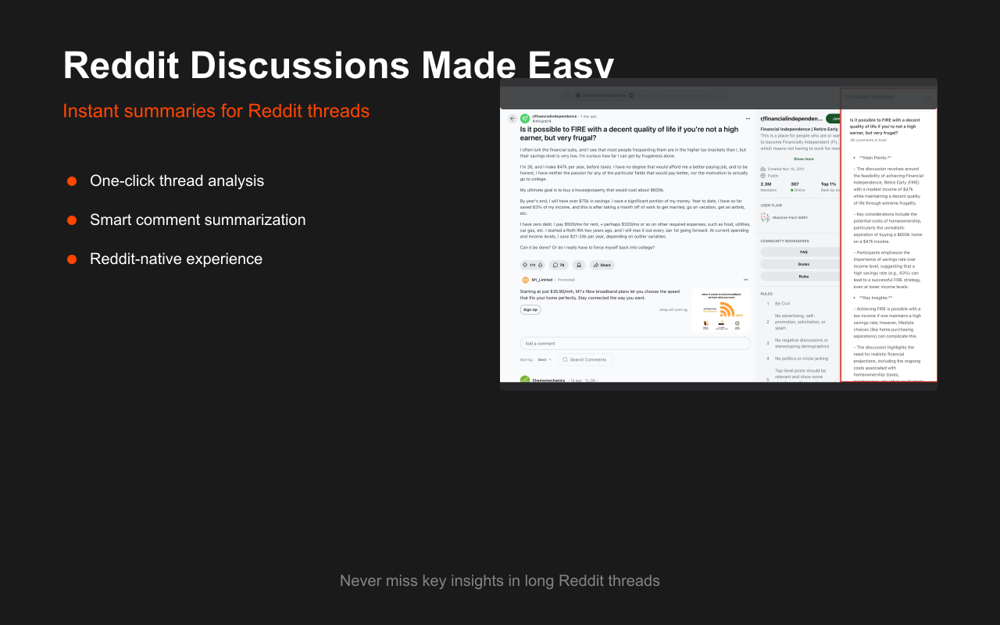
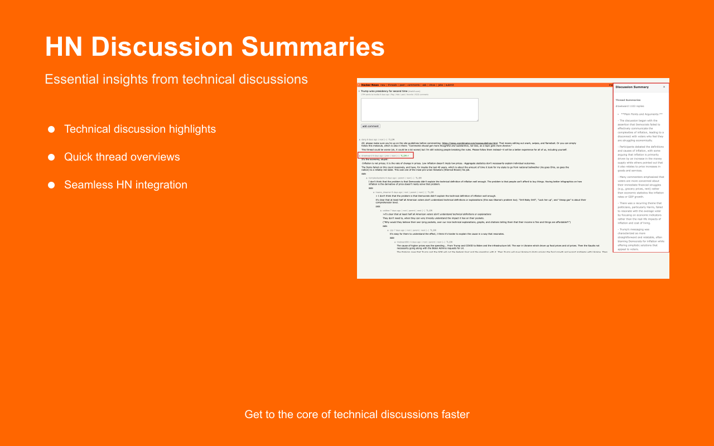
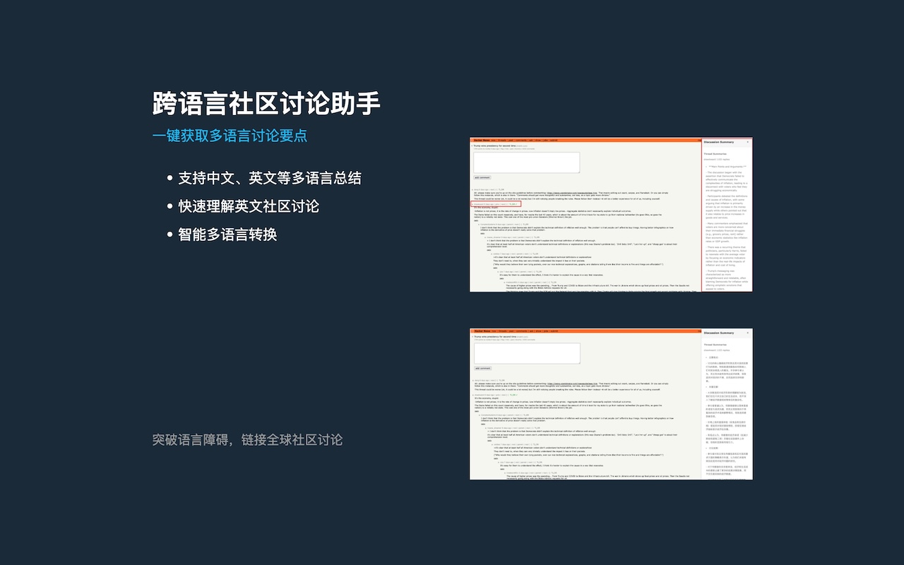

# Community TL;DR

A Chrome extension powered by AI to generate quick summaries of community discussions. Get insights from lengthy threads without reading through everything.

Currently released on the [Chrome Web Store](https://chromewebstore.google.com/detail/community-tldr/kikhlploiflbfpdliimemhelcpneobfm).





## Features

- 🤖 AI-powered discussion summarization
- 🌐 Support for major communities (Hacker News, Reddit)
- 🌍 Multiple language support
  - English
  - Chinese (中文)
  - Japanese (日本語)
  - Korean (한국어)
- ⚙️ Flexible AI backend
  - Custom API endpoint
  - OpenAI API
  - Anthropic Claude
  - Cloudflare AI Worker
- 📱 Thread-level summaries with side-by-side view
- 🎯 Focus on key points and insights
- 📊 Smart content analysis and language translation

## Supported Communities

Currently supported:

- ✅ Hacker News discussions
- ✅ Reddit threads

Coming soon:
- 🔄 Twitter threads
- 🔄 GitHub Discussions
- More suggestions welcome!

## Installation

### Chrome Web Store (Recommended)

1. Visit the [Chrome Web Store page](https://chromewebstore.google.com/detail/community-tldr/kikhlploiflbfpdliimemhelcpneobfm)
2. Click "Add to Chrome"
3. Follow the installation prompts

### Manual Installation (Development)

1. Clone the repository
2. Install dependencies: `npm install`
3. Build: `npm run build`
4. Load unpacked extension from `dist` folder

## Configuration

1. Click the extension icon and go to Settings
2. Configure your AI service:
   - Custom Endpoint (recommended)
   - OpenAI
   - Anthropic (Claude)
   - Cloudflare AI Worker
3. Set your preferred:
   - Summary language
   - Summary length
   - Auto-summarize options
4. Save settings and start using

## Usage

1. Visit a supported site (Hacker News or Reddit)
2. Click the extension icon or use the TL;DR button
3. Choose summarization options:
   - Full discussion summary
   - Individual thread summary
4. View summaries in the sidebar
5. Click summaries to navigate to original content

## Development

```bash
# Install dependencies
npm install

# Development build with watch mode
npm run dev

# Production build
npm run build
```

## Contributing

We welcome contributions! See our [Contributing Guide](CONTRIBUTING.md) for:
- Adding new community support
- Improving summarization
- Bug fixes and feature enhancements
- Documentation improvements

### Adding Support for New Communities

Check our [Contributing Guide](CONTRIBUTING.md) for:
- Architecture overview
- Parser implementation
- Testing requirements
- PR submission process

## Roadmap

## Phase 1: Core Feature Enhancement

### Universal Content Support
- [ ] Generic webpage & article summarization
  - Basic article parsing engine
  - Support for common article layouts
  - Handling of dynamic content
- [ ] Email thread summarization
  - Gmail basic integration
  - Email thread parser
  - Plain text email support
- [ ] Additional community platforms
  - Twitter/X threads
  - GitHub Discussions
  - Stack Overflow Q&A

### Self-hosted Web Version
- [ ] Basic web application
  - Docker deployment support
  - Simple URL input interface
  - Summary viewing & sharing
- [ ] Chrome extension sync capability
  - Local storage sync
  - Settings synchronization
  - History sync (optional)
- [ ] Basic API endpoints
  - Summary generation
  - URL processing
  - Health checks

## Phase 2: Technical Improvements

### Parser Framework Enhancement
- [ ] Modular parser architecture
  - Easy addition of new sources
  - Parser plugin system
  - Common parsing utilities
- [ ] Content extraction improvements
  - Better noise removal
  - Main content detection
  - Comment thread handling

### AI Backend Flexibility
- [ ] Enhanced AI provider support
  - Improved prompt templates
  - Better error handling
  - Failover support
- [ ] Local AI model support
  - Basic local model integration
  - Offline capabilities
  - Model selection flexibility

## Phase 3: Quality of Life Features

### User Experience
- [ ] Improved summary formats
  - Bullet point summaries
  - Key points extraction
  - Source linking
- [ ] Basic customization
  - Summary length options
  - Language preferences
  - Style selection

### Developer Experience
- [ ] Documentation improvements
  - Setup guides
  - API documentation
  - Contributing guidelines
- [ ] Development tooling
  - Testing frameworks
  - Development containers
  - Local development setup

## Continuous Improvement

### Core Functionality
- [ ] Performance optimization
- [ ] Bug fixes
- [ ] Code quality improvements
- [ ] Test coverage expansion

### Community
- [ ] Issue template refinement
- [ ] Pull request guidelines
- [ ] Community support channels
- [ ] Regular maintenance updates

## Privacy & Security

- No user data collection
- Local storage for settings only
- Secure API handling
- Privacy-focused design
